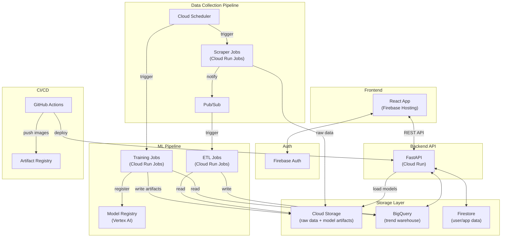
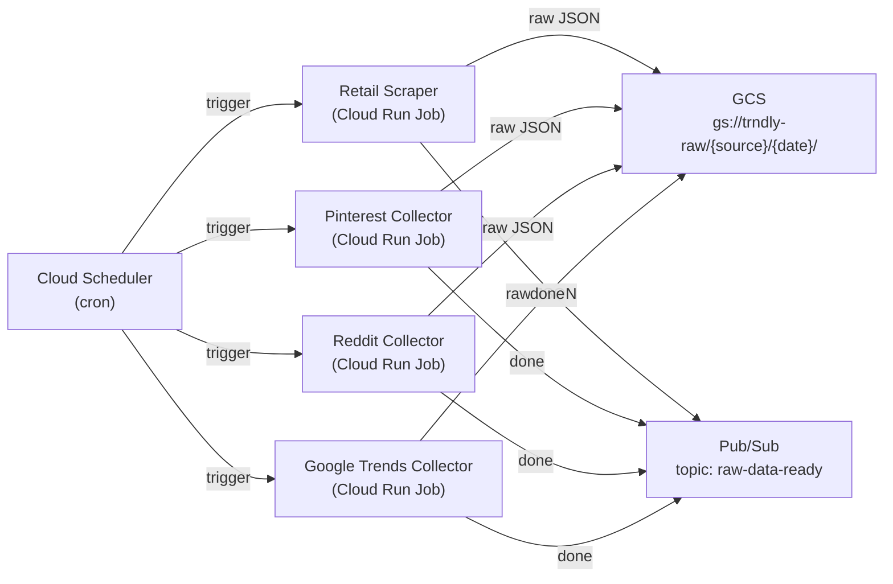

# trndly — Architecture

## System Overview

trndly is a fashion trend forecasting platform that helps secondhand apparel resellers sell and stock inventory faster by surfacing current and predicted trends. The architecture is fully serverless and scale-to-zero on GCP, keeping costs near zero during development and scaling linearly with usage in production.

**Core stack:** React frontend, Python/FastAPI backend, GCP-managed data and ML infrastructure.



---

## 1. Frontend — React on Firebase Hosting

| Concern | Choice |
|---|---|
| Framework | React (Vite + TypeScript) |
| Hosting | Firebase Hosting (global CDN, free tier: 10 GB storage, 360 MB/day transfer) |
| Auth | Firebase Auth (Google sign-in, email/password) |
| Charting | Recharts or Plotly.js for time-series plots (Listing Scheduler feature) |
| Data fetching | TanStack Query (caching, background refetches) |
| Routing | React Router |

The React app is a single-page application that communicates with the FastAPI backend over REST. Firebase Auth issues JWTs on the client side; every API call includes the token in an `Authorization` header for server-side validation.

### Feature → UI Mapping

- **Listing Scheduler** — User adds inventory items; each item displays a time-series chart showing projected sell price over time and a recommended listing window.
- **Trend Radar** — Dashboard with selectable time horizons (Today, Next Week, 1 Month, 3 Months). Each horizon surfaces predicted trending colors, styles, materials, articles, and vibes.
- **Sourcing Recommendations** — Ranked list of top-K item types to buy now, with projected resale price, expected profit, and a buy-in ceiling price.

---

## 2. Backend API — FastAPI on Cloud Run

| Concern | Choice |
|---|---|
| Framework | FastAPI (Python 3.11+) |
| Runtime | Cloud Run (scale to zero, 2M requests/month free) |
| Containerization | Docker (single image for the API service) |
| Auth | Middleware validates Firebase Auth JWTs via `google-auth` |

### Responsibilities

- Serve all three product features via versioned REST endpoints (`/api/v1/...`).
- Load trained model artifacts from GCS at startup and cache them in memory. On new model deployment, a fresh Cloud Run revision is rolled out so artifacts are reloaded.
- Query BigQuery for processed trend data (read-heavy, write-rare).
- Read/write user data (inventory, preferences, listing schedules) in Firestore.

### Key API Routes

```
POST   /api/v1/auth/verify          # validate Firebase token, return user profile
GET    /api/v1/trends/{horizon}      # Trend Radar — horizon: today | week | month | 3month
POST   /api/v1/listings/schedule     # Listing Scheduler — accepts inventory list, returns schedule
GET    /api/v1/sourcing/recs         # Sourcing Recommendations — top-K buy suggestions
POST   /api/v1/inventory             # add / update inventory items
GET    /api/v1/inventory             # list user inventory
```

---

## 3. Data Collection Pipeline



### Sources and Cadence

| Source | Method | Cadence |
|---|---|---|
| Retail sites (3–5) | Web scraping (item descriptions + metadata) | Daily |
| Pinterest | Trends API + Gemini for interpretation | Daily |
| Reddit | API (fashion subreddits: r/streetwear, r/malefashionadvice, etc.) | Daily |
| Google Trends | `pytrends` library | Daily |
| H&M Kaggle dataset | One-time bulk load into GCS | Bootstrap |
| DeepFashion dataset | One-time bulk load into GCS | Bootstrap |

Each collector is a standalone Cloud Run Job with its own Docker image. Cloud Scheduler fires each job on a cron expression. On completion, each job publishes a message to a Pub/Sub topic (`raw-data-ready`) that triggers downstream ETL.

Raw data is written to GCS under a consistent partition scheme: `gs://trndly-raw/{source}/{YYYY-MM-DD}/`.

---

## 4. Data Storage Layer

### Cloud Storage (GCS)

| Bucket | Contents |
|---|---|
| `trndly-raw` | Raw scraped data (JSON/CSV), partitioned by source and date |
| `trndly-historical` | One-time loaded historical datasets (H&M, DeepFashion) |
| `trndly-models` | Trained model artifacts, versioned by timestamp (e.g., `models/trend-forecast/2026-03-29T12:00:00/`) |

### BigQuery

Single dataset `trndly` with tables for:

| Table | Description |
|---|---|
| `trend_signals` | Unified, cleaned trend observations from all sources (date, category, signal_type, signal_value, strength) |
| `item_metadata` | Normalized item catalog (article type, color, material, style tags) |
| `price_history` | Historical and scraped price points by item category |
| `aggregated_features` | Pre-computed feature tables consumed directly by ML training and the API |

BigQuery is the single source of truth for all ML training and analytical API queries. Its serverless model means no provisioned capacity — queries are billed per TB scanned (1 TB/month free).

### Firestore

Collections:

| Collection | Documents |
|---|---|
| `users` | User profile, preferences, account metadata |
| `inventory` | User's current inventory items (linked to user) |
| `listing_schedules` | Generated listing schedules per inventory item |

Firestore is chosen over Cloud SQL for its serverless scaling, generous free tier (50K reads/day, 20K writes/day), and natural fit with Firebase Auth on the frontend.

---

## 5. ML Pipeline and Model Serving

### ETL

Triggered by Pub/Sub messages from the data collection pipeline. Cloud Run Jobs read raw data from GCS, clean/normalize it, and write structured rows into BigQuery tables. ETL jobs include schema validation and basic distribution checks — failures are logged and surfaced via Cloud Monitoring alerts.

### Models

| Model | Purpose | Approach |
|---|---|---|
| Trend Forecaster | Predict trend strength over time horizons (Trend Radar, Listing Scheduler) | Time-series forecasting — Prophet or a lightweight temporal model |
| Item Classifier | Categorize items by style, color, material, vibe from text/image | NLP embeddings (sentence-transformers) + optional image features |
| Sourcing Ranker | Score item categories for buy-low-sell-high potential | Ranking model combining current popularity, predicted trajectory, and current market price |

### Training

- Cloud Run Jobs read feature tables from BigQuery, train models, and write serialized artifacts (pickle, ONNX, or joblib) to the `trndly-models` GCS bucket.
- Each training run is tagged with a version timestamp and registered in **Vertex AI Model Registry** with associated metrics (MAE, RMSE, precision, etc.).
- Cloud Scheduler triggers retraining on a **weekly** cadence. Manual triggers are also supported for ad-hoc runs.

### Serving

The FastAPI backend loads the latest model artifacts from GCS at startup. No dedicated model-serving infrastructure (e.g., Vertex AI Endpoints) is needed at this scale — inference runs in-process on the Cloud Run container's CPU. When a new model version is promoted, a fresh Cloud Run revision is deployed to pick up the updated artifacts.

---

## 6. ML Ops Practices

| Practice | Implementation |
|---|---|
| **Model Versioning** | Every training run writes a timestamped artifact to GCS and registers it in Vertex AI Model Registry with metrics and metadata |
| **Automated Retraining** | Cloud Scheduler triggers training Cloud Run Jobs weekly; manual trigger available via `gcloud` or GitHub Actions dispatch |
| **Data Validation** | ETL jobs run schema + distribution checks on incoming data before writing to BigQuery; validation failures fire Cloud Monitoring alerts |
| **Model Monitoring** | Scheduled BigQuery query compares recent predictions against observed actuals; significant drift triggers an alert and an optional early retraining run |
| **Experiment Tracking** | Vertex AI Experiments logs hyperparameters, metrics, and dataset versions for every training run |
| **Secrets Management** | All API keys and credentials stored in Secret Manager; injected into Cloud Run services/jobs as environment variables at deploy time |

---

## 7. CI/CD and DevOps

### GitHub Actions Workflows

| Trigger | Pipeline |
|---|---|
| Pull request | Lint (`ruff`), type-check (`mypy`), unit tests (`pytest`), build Docker images (no push) |
| Merge to `main` | Build + push images to **Artifact Registry**, deploy to Cloud Run (staging environment), run integration tests |
| Manual dispatch | Promote staging → production (swap Cloud Run traffic) |

### Infrastructure as Code

All GCP resources are defined in **Terraform**:

- Cloud Run services and jobs
- BigQuery datasets and tables
- GCS buckets
- Cloud Scheduler jobs
- Pub/Sub topics and subscriptions
- Firestore database
- IAM roles and service accounts
- Secret Manager secrets
- Artifact Registry repository

Terraform state is stored in a GCS backend bucket.

### Observability

- **Cloud Logging** — structured logs from all Cloud Run services and jobs.
- **Cloud Monitoring** — dashboards and alerts for: API latency/error rates, job success/failure, data validation issues, model drift.

---

## 8. Repository Structure

```
trndly/
├── frontend/                   # React app (Vite + TypeScript)
│   ├── src/
│   │   ├── components/         # Shared UI components
│   │   ├── features/           # Feature modules (trends, listings, sourcing)
│   │   ├── hooks/              # Custom React hooks
│   │   ├── services/           # API client, auth helpers
│   │   └── App.tsx
│   ├── package.json
│   └── vite.config.ts
├── backend/                    # FastAPI app
│   ├── app/
│   │   ├── routers/            # API route handlers per feature
│   │   ├── models/             # Pydantic request/response schemas
│   │   ├── services/           # Business logic + model inference
│   │   └── core/               # Auth middleware, config, dependencies
│   ├── requirements.txt
│   └── Dockerfile
├── pipelines/
│   ├── collectors/             # One module per data source
│   │   ├── retail_scraper.py
│   │   ├── pinterest_collector.py
│   │   ├── reddit_collector.py
│   │   └── google_trends_collector.py
│   ├── etl/                    # Transform + load into BigQuery
│   │   └── transform_load.py
│   └── training/               # Model training scripts
│       ├── train_forecaster.py
│       ├── train_classifier.py
│       └── train_ranker.py
├── infrastructure/             # Terraform configs
│   ├── main.tf
│   ├── variables.tf
│   ├── cloud_run.tf
│   ├── bigquery.tf
│   ├── storage.tf
│   └── scheduler.tf
├── docker/                     # Dockerfiles for pipeline jobs
│   ├── collector.Dockerfile
│   ├── etl.Dockerfile
│   └── training.Dockerfile
├── .github/
│   └── workflows/
│       ├── ci.yml              # PR checks
│       └── deploy.yml          # Build, push, deploy on merge
├── tests/
│   ├── unit/
│   └── integration/
├── architecture.md
└── notes.md
```

---

## 9. Cost Estimate

### Development Phase (Free Tier Coverage)

| Service | Free Tier Allowance | Expected Dev Usage |
|---|---|---|
| Cloud Run | 2M req/mo, 180K vCPU-sec, 360K GiB-sec | Well within limits |
| BigQuery | 1 TB queries/mo, 10 GB storage | Well within limits |
| Firestore | 50K reads/day, 20K writes/day, 1 GiB storage | Well within limits |
| Cloud Storage | 5 GB | Sufficient for raw data + models during dev |
| Firebase Hosting | 10 GB storage, 360 MB/day transfer | Well within limits |
| Firebase Auth | 10K monthly active users | Well within limits |
| Cloud Scheduler | 3 free jobs ($0.10/mo per additional job) | ~6 jobs needed, ~$0.30/mo overage |
| Pub/Sub | 10 GB/mo | Well within limits |
| Secret Manager | 6 active secret versions | Sufficient |
| Vertex AI Model Registry | Free (GCS storage cost only) | Negligible |
| Artifact Registry | 0.5 GB free | Sufficient for a few images |

**Estimated monthly cost during development: $0 – $5**

### Production Considerations

The serverless architecture means costs grow proportionally with user traffic and data volume. The primary cost drivers at scale would be:

1. **Cloud Run** — scales with API request volume.
2. **BigQuery** — scales with query volume and data stored.
3. **Cloud Storage** — scales with raw data accumulation (implement lifecycle policies to archive/delete old raw data).
4. **Gemini API** — per-call cost for Pinterest trend interpretation.

Lifecycle policies on GCS buckets and BigQuery table expiration on staging tables keep storage costs from growing unboundedly.
